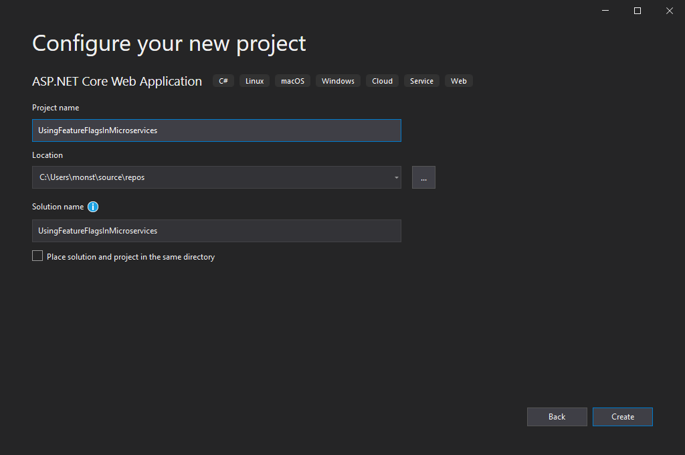
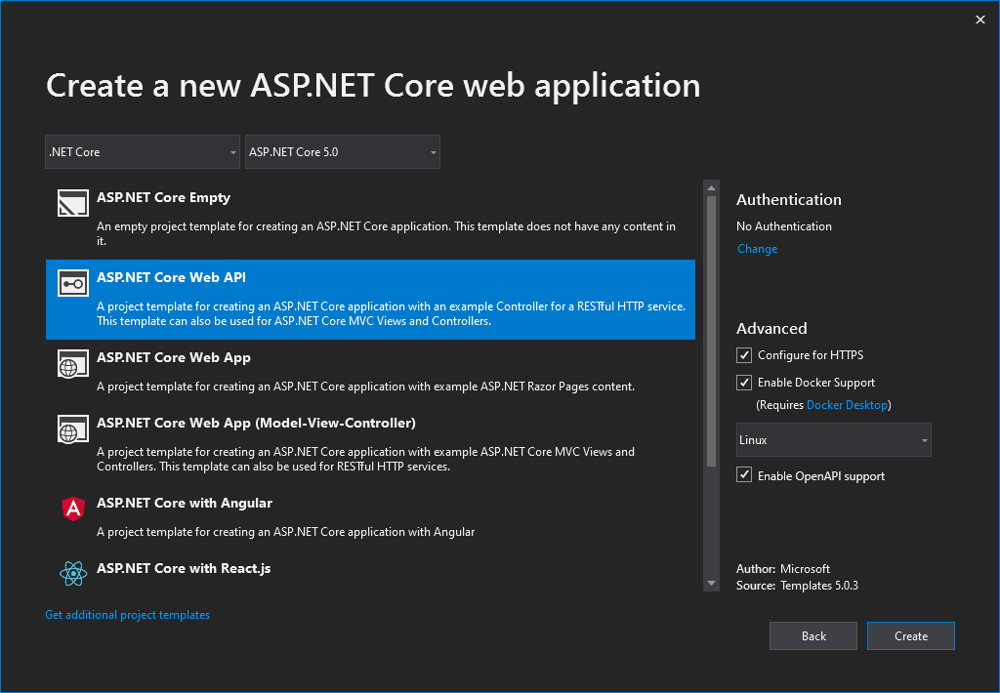
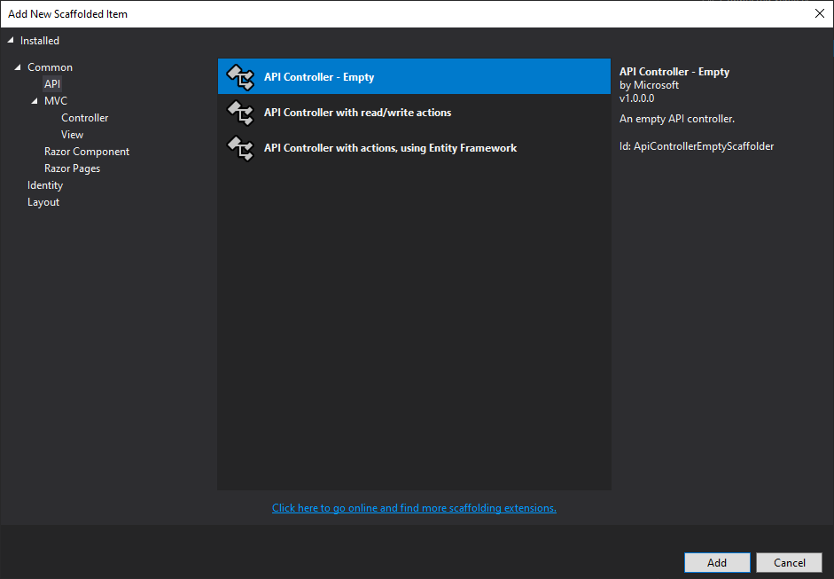
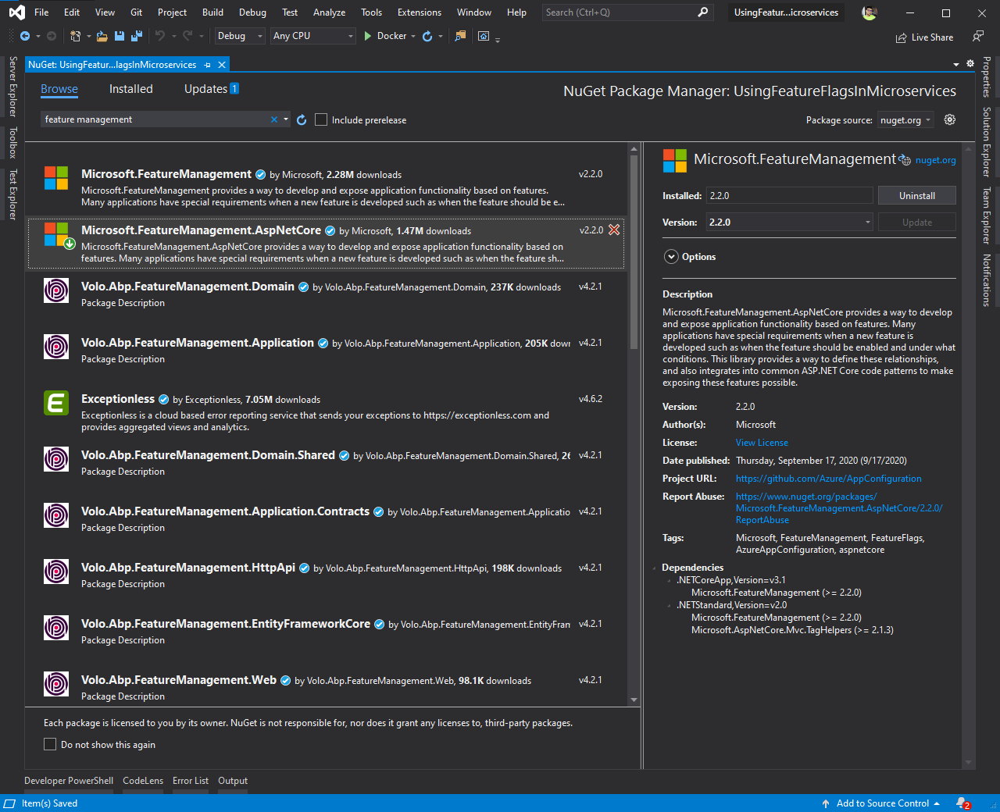
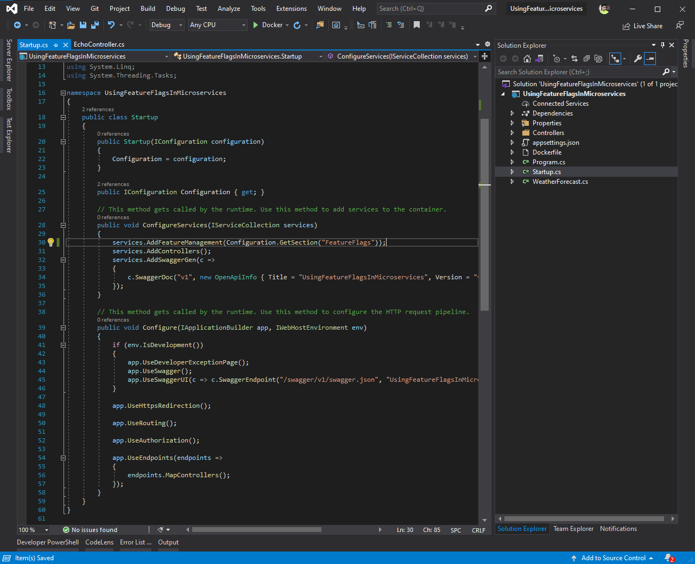
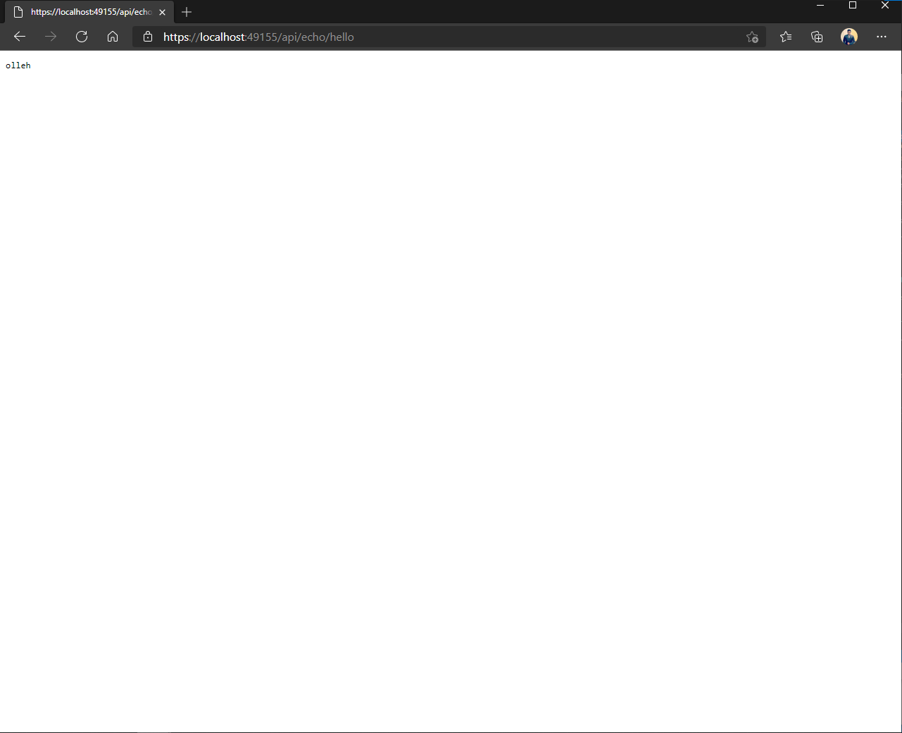
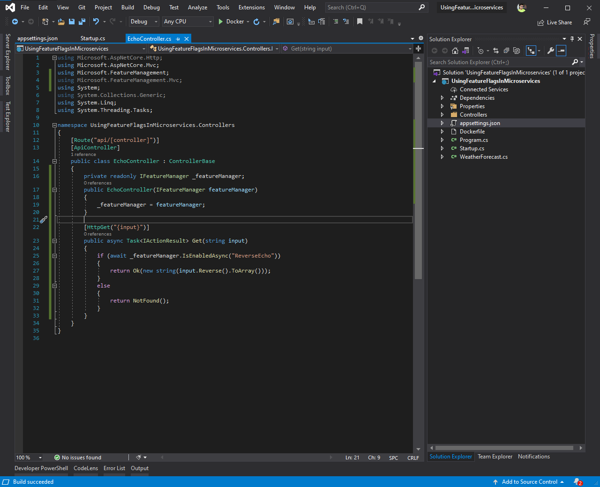
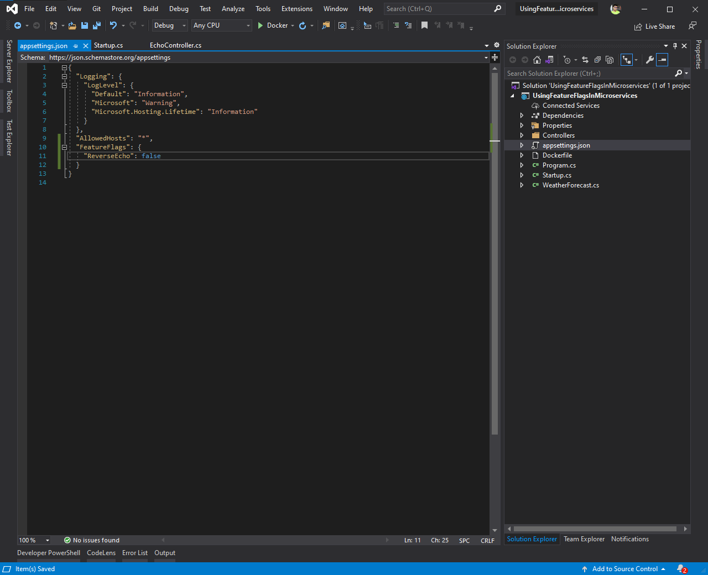
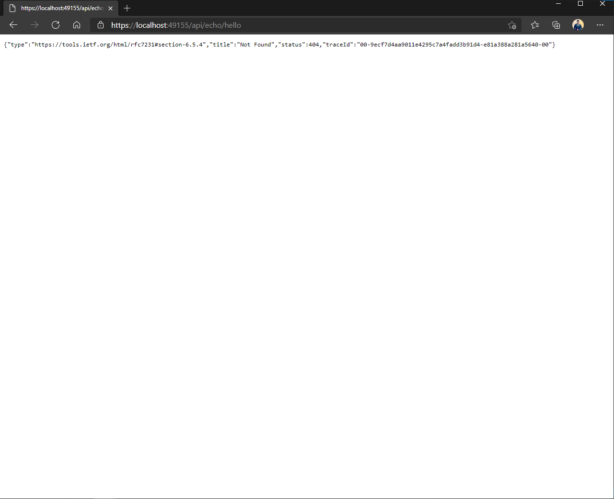

# Using `Feature Flags` aka `Feature Toggles` in Microservices and DevOps
## What's a Feature Flag/Feature Toggle
Cloud Native Microservices and DevOps are much about speed and agility. Users expect rapid responsiveness, innovative features, and zero downtime. Feature flags are a modern deployment technique that helps increase agility for cloud-native applications. They enable you to deploy new features into a production environment, but restrict their availability. With the flick of a switch, you can activate a new feature for specific users without restarting the app or deploying new code. They separate the release of new features from their code deployment.

-[Microsoft Cloud Native Application Architecture Guide](https://docs.microsoft.com/en-us/dotnet/architecture/cloud-native/feature-flags)

[Launch Darky](https://launchdarkly.com/blog/what-are-feature-flags), a popular Feature Management company defines Feature Flags as:
> A feature flag is a software development process used to enable or disable functionality remotely without deploying code.

New features can be deployed without making them visible to users. Feature flags help decouple deployment from release letting you manage the full lifecycle of a feature.

Feature Flags aks Feature Toggles as [Martin Fowler](https://www.martinfowler.com/articles/feature-toggles.html) explains:

> Feature Toggles (often also refered to as Feature Flags) are a powerful technique, allowing teams to modify system behavior without changing code.

They fall into various usage categories, and it's important to take that categorization into account when implementing and managing toggles. Toggles introduce complexity. We can keep that complexity in check by using smart toggle implementation practices and appropriate tools to manage our toggle configuration, but we should also aim to constrain the number of toggles in our system.

## Why Feature Flags?
Some of the use cases, as [CloudBees](https://www.cloudbees.com/feature-flags) aptly lists:
### Separating Deployment From Feature Roll-out:

 Deploying code carries what I’ll call technical risk.  Software might crash or bugs might emerge.  Deploying features carries user-related risk.  Users might hate the new features, or you might have account management issues, for instance.

 Traditionally, you just absorb all this risk at once.  With feature flags, you can separate these risks.  You put the new code into production, see how that goes, and then turn the features on later once they’re settled from a technical perspective.

### Testing in Production
Conventional wisdom has always held that you don’t test in production.
But Facebook, Netflix, and others giant companies couldn’t possibly recreate their production environments for test, so they have to run QA in production.  And in doing so, they’ve proved that there’s an awful lot of value to the activity.

So when using feature flags, you can de-risk deploying functionality whose production behavior is unknown to you.  Of course, you always want to test everything you can as early as you can.  But it’s nice to have options.

 
### Turning Things Off With a Kill Switch
Just as you can use feature flags to increase the number of users that see a feature, you can also go in the opposite direction.  You can decrease the number seeing it, including decreasing it immediately to zero with a conceptual kill switch.


### Canary Launches
With a canary release, you introduce the new code gradually to your user base. If there is an issue, you can find out with only a fraction of the user base seeing it, rather than everyone inundating you at once with support requests. 

### Running Experiments
Using feature flags to run production experiments.  The easiest one of these to explain is the A/B test.

With an A/B test, you go to production with two different versions of something to see which does the best.  For instance, perhaps you run an e-commerce site, and you want to see whether a green or red “buy” button results in more likes.  You can deploy both buttons and use a feature flag to split your user base in half and see which button performs the best.


## Let me see some code

Enough with the theory, let's dive into action.
For this article we're creating an .NET Core (well, .NET 5 technically) Miroservice. 

### Create a new Project.
* Let's create a new ASP.NET Core API Project with .NET 5 and Docker Support.



* The initial project structure looks like this:


### Add a new Feature
Now we'll add a new feature in our Microservice which `echo`s the reverse of content received.
e.g. If we say _hello_, the Microservice should return _olleh_.

* Add a new Controller named `EchoController`. Choose Empty, we'll write all the code we need from scratch.


* Add following super complex code to the Echo
    ````csharp
    using Microsoft.AspNetCore.Mvc;
    using Microsoft.FeatureManagement;
    using Microsoft.FeatureManagement.Mvc;
    using System;
    using System.Collections.Generic;
    using System.Linq;
    using System.Threading.Tasks;

    namespace UsingFeatureFlagsInMicroservices.Controllers
    {
        [Route("api/[controller]")]
        [ApiController]
        public class EchoController : ControllerBase
        {      
            [HttpGet("{input}")]        
            public async Task<IActionResult> Get(string input)
            {
                return Ok(new string(input.Reverse().ToArray())); 
            }
        }
    }

    ````

    The endpoint takes a `string`, reverses it and sends it as `HTTP 200`.

### Add Feature Management
We can implement a feature management on own, however why to re-invent the wheel when someone else has done it.

We'll use [Microsoft.FeatureManagement.AspNetCore](https://www.nuget.org/packages/Microsoft.FeatureManagement.AspNetCore) for our Microservice.

* Add the package


### Anatomy of Feature Flags/Feature Toggles
There are 3 things we need to take care of:
1. Where to store the Feature Flag/Feature Toggles?
2. How to tell our application that we'll use Feature Management?
3. How to use it in code to restrict functionality?

We'll address all these one by one

### 1. Where to store the Feature Flag/Feature Toggles?
For this article we're storing our Feature Flags in ASP.NET Core configuration. This can either be `appsettings.<Environment>.json` or Operating System Environment Variables or if you're deploying your app in any PaaS service like `Azure App Service` or `AWS Beanstalk`, you can store in it in respective configuration stores.
We'll create a root element `FeatureFlags` and a Feature named `ReverseEcho`.
````json
{
  "FeatureFlags": {
    "ReverseEcho": true
  }
}
````
Here's how our `appsettings.json` looks like:

### 2. How to tell our application that we'll use Feature Management?
We'll use our Dependency Injection container to add Feature Management Service:

````csharp
 // This method gets called by the runtime. Use this method to add services to the container.
public void ConfigureServices(IServiceCollection services)
{
    // Other services
    services.AddFeatureManagement(Configuration.GetSection("FeatureFlags"));
    services.AddControllers();
    // Other services
}
````
> By default `AddFeatureManagement` from `Microsoft.FeatureManagement.AspNetCore` looks for key named `FeatureManagement`, we've used an overload to specify a custom section for our Feature Management configuration.

`Startup.cs` looks something like this:


### 3. How to use it in code to restrict functionality?

`Microsoft.FeatureManagement.AspNetCore` Provides multiple ways to check for Feature Flags:
#### 1. Using a `Filter Attribute` named `FeatureGate`
* Add an `MVC` `Filter Attribute` named `FeatureGate` to an `Action Method`.
````csharp
[Route("api/[controller]")]
[ApiController]
public class EchoController : ControllerBase
{   
    [HttpGet("{input}")]
    [FeatureGate("ReverseEcho")]
    public async Task<IActionResult> Get(string input)
    {
        return Ok(new string(input.Reverse().ToArray()));
    }
}
````


Only if the _ReverseEcho_ `Feature Flag` is true, this `Action Method` would be called.
* Test the behaviour by running the application and hitting the URL https://localhost:49155/api/echo/hello. Response returned _olleh_ as expected.


#### 2. Using `IFeatureManager` interface
* Inject the `IFeatureManager` interface and check whether the Feature Flag is enabled.
* 
````csharp
[Route("api/[controller]")]
[ApiController]
public class EchoController : ControllerBase
{
    private readonly IFeatureManager _featureManager;
    public EchoController(IFeatureManager featureManager)
    {
        _featureManager = featureManager;
    }

    [HttpGet("{input}")]        
    public async Task<IActionResult> Get(string input)
    {
        if (await _featureManager.IsEnabledAsync("ReverseEcho"))
        {
            return Ok(new string(input.Reverse().ToArray()));
        }
        else
        {
            return NotFound();
        }
    }
}
````


* Test the behaviour by running the application and hitting the URL https://localhost:49155/api/echo/hello. Response returned _olleh_ as expected.

### Disabling the Feature Flag
* If we disable the flag by settign its value to `false`:
````json
{
  "FeatureFlags": {
    "ReverseEcho": false
  }
}
````

* Observe an `HTTP 404` is returned.
````json
{
    "type" : "https://tools.ietf.org/html/rfc7231#section-6.5.4",
    "title" : "Not Found",
    "status" : 404,
    "traceId" : "00-0cf135c3abca6548b0651f57edf39416-a0833546ef13cb4e-00"
}
````



Congratulations, you just implemented Feature Flags/Feature Toggles in your Microservice. Of course string reversal example was far from a real-world feature, but now we understand the idea.

### Advanced Feature Management Features
Instead of just `true`/`false`, Microsoft.FeatureManagement.AspNetCore provides many advanced feaures as well. 

[Read more here](https://github.com/microsoft/FeatureManagement-Dotnet)

## Next Steps
* https://docs.microsoft.com/en-us/dotnet/architecture/cloud-native/feature-flags
* https://launchdarkly.com/blog/what-are-feature-flags
* https://www.cloudbees.com/feature-flags
* https://github.com/microsoft/FeatureManagement-Dotnet